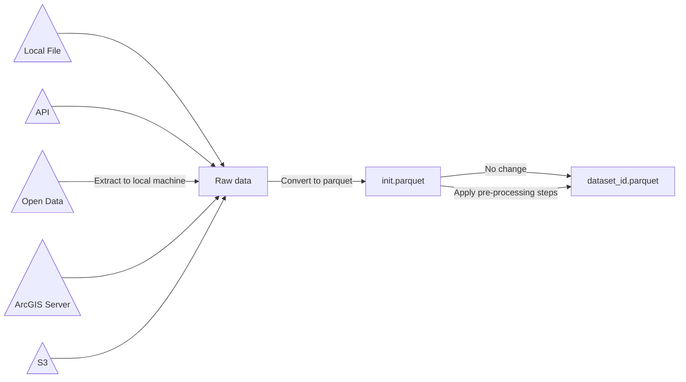

### Extract data with ingest tool by running this:
```bash
python3 -m dcpy.cli lifecycle ingest dpr_forever_wild -s
```

### Ingest tool in action


### Output files
- `config.json`: this is a metadata file about data and ingestion process. 
- `init.parquet`: raw data in parquet format
- `<dataset_id>.<format extension>`: raw data. Example: `dpr_forever_wild.zip`.
- `<dataset_id>.parquet`: output data. Example: `dpr_forever_wild.parquet`. If pre-processing steps were not specified in dataset template, then this file will be the same as `init.parquet`

### Instruction how to create a template
TODO
